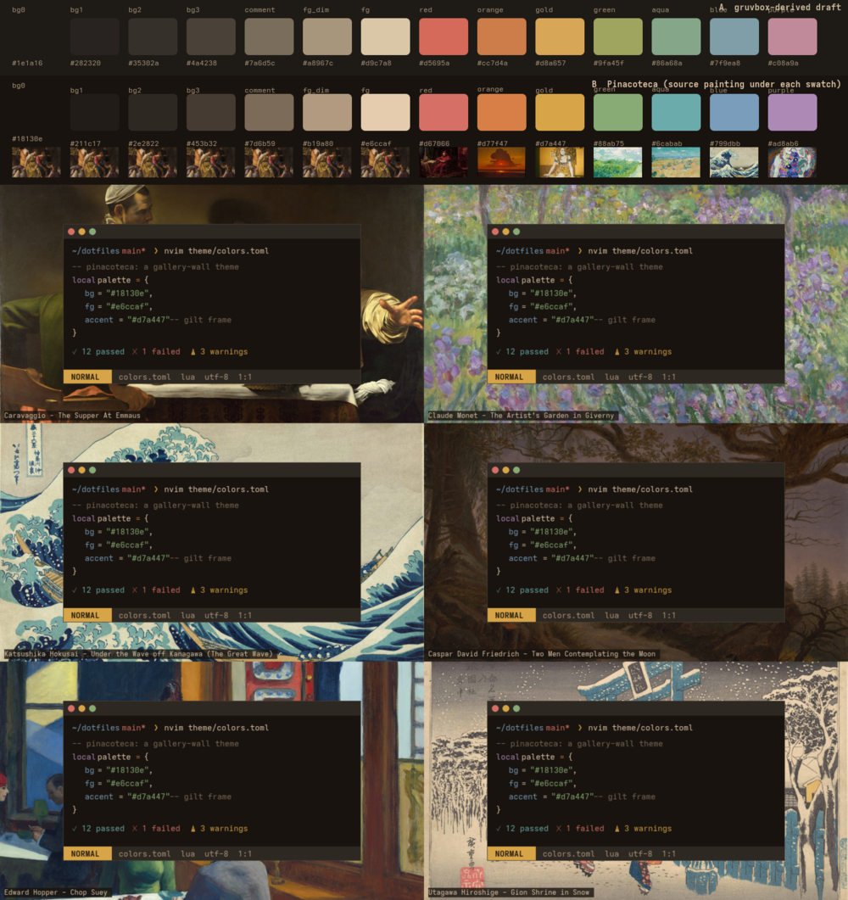

# Pinacoteca

A gallery-wall theme. The wallpaper is a slideshow of paintings; the interface is the
wall they hang on. Museums hang wildly different works on the same wall, with the same
frames and lighting, and it reads as one place. Pinacoteca does the same for a desktop.



Row A in the preview is a gruvbox-derived draft kept for comparison. Row B is the
palette in `colors.toml`, with the source painting under each swatch.

## Rules

1. **Every hue is sampled from a painting on the wall.** `colors.toml` records the
   painting and the k-means cluster each pigment came from. Nothing is invented.
2. **Hue from the pigment, lightness from the ladder.** Colours are placed in OKLCH.
   All accents sit at roughly the same perceived lightness and every text colour
   clears 4.5:1 on the background. Chroma is clamped into a legibility band.
3. **The wall is neutral umber.** Backgrounds differ by lightness only, never by hue.
4. **One pigment per token family.** Identifiers and punctuation stay in linen.
   Colour marks meaning, not structure.
5. **Diagnostics are their own family.** Errors, warnings, info and hints reuse the
   pigments but never share a highlight with syntax.
6. **The frame responds, the text does not.** Borders, cursor and mode indicators may
   follow the current wallpaper. Syntax never does. (Planned; not wired yet.)

## Palette

| Role | Hex | Source painting |
| --- | --- | --- |
| wall (bg0 to bg3, comment) | `#18130e` `#211c17` `#2e2822` `#453b32` `#7d6b59` | Vermeer, Diana and Her Nymphs |
| linen (fg_dim, fg, fg_bright) | `#b19a80` `#e6ccaf` `#f7e5cf` | Vermeer, Diana and Her Nymphs |
| red | `#d67066` | Matejko, Stańczyk |
| orange | `#d77f47` | Kuindzhi, Red Sunset on the Dnipro |
| gold (accent) | `#d7a447` | Portrait of a Woman against a Gold Decorative Background |
| green | `#88ab75` | Van Gogh, Green Wheat Fields, Auvers |
| aqua | `#6cabab` | Van Gogh, Wheat Fields with Reaper, Auvers |
| blue | `#799dbb` | Hokusai, Under the Wave off Kanagawa |
| purple | `#ad8ab6` | Klimt, Virgin |

## Where each port lives

The theme is applied in each tool's own config so that every platform links the same
files it already links. `colors.toml` is the source of truth and follows the Omarchy
layout, so it can be dropped into an Omarchy theme directory unchanged. Every port
below is rendered from a template in `templates/` by `tools/build.py`; do not edit
the colours in the ports by hand.

| Tool | File |
| --- | --- |
| WezTerm | `.config/wezterm/wezterm.lua` (`color_schemes.pinacoteca`) |
| Neovim | `.config/nvim/colors/pinacoteca.lua`, generated with mini.base16 |
| tmux | `.config/tmux/pinacoteca.conf`, a status line laid out after [tokyo-night-tmux](https://github.com/janoamaral/tokyo-night-tmux), and its git segment `pinacoteca-git.sh` |
| Starship | `.config/starship.toml` (`palettes.pinacoteca`) |
| VS Code | `.config/Code/User/settings.json` on top of Default Dark Modern |
| PowerShell | `.config/powershell/Microsoft.PowerShell_profile.ps1` (PSReadLine) |
| fzf | `home/.zshrc` (`FZF_DEFAULT_OPTS`) |
| btop | `.config/btop/themes/pinacoteca.theme`, select it in btop's menu |
| Alacritty | `.config/alacritty/pinacoteca.toml`, imported by `alacritty.toml` |
| Ghostty | `.config/ghostty/themes/pinacoteca` |
| Zed | `.config/zed/themes/pinacoteca.json` |
| Herdr | `.config/herdr/config.toml` (`theme.custom`) |
| Spotify | `.config/spicetify/Themes/Pinacoteca`, then `spicetify config current_theme Pinacoteca color_scheme Pinacoteca` and `spicetify apply` |
| T3 Code | `theme/pinacoteca/t3code.json`, imported in Settings → Themes |
| Windows Terminal | `theme/pinacoteca/windows-terminal.json`, installed as a fragment |
| Windows accent | `theme/pinacoteca/windows-accent.ps1` sets the accent to gold |
| Homepage | `homepage-v2/src/styles/theme.css` and `src/lib/shiki/pinacoteca.mjs` |

## Regenerating

The palette was derived by sampling 12-colour k-means clusters from each source
painting with ImageMagick, converting to OKLCH, keeping hue, clamping chroma, and
setting lightness from the ladder. `tools/oklch.py` does the colour maths.

To change a colour, edit `colors.toml` and render the ports:

```bash
python3 theme/pinacoteca/tools/build.py
HOMEPAGE=~/projects/homepage-v2 python3 theme/pinacoteca/tools/build.py   # also the site
python3 theme/pinacoteca/tools/build.py --check                            # what the CI runs
```

`ports.toml` lists each output and its template. Whole-file ports are overwritten;
ports marked `block` only replace the text between `pinacoteca:begin` and
`pinacoteca:end` marker lines, so the rest of that file stays hand-edited; the VS
Code port merges three keys into `settings.json`. Templates use `{{role}}`
placeholders with optional modifiers such as `{{gold:upper}}`, `{{bg3:rgb}}` or
`{{gold:l=82}}`, the last of which derives a shade in OKLCH so that even the
site-only tints follow the ladder rule.

`tools/render-preview.sh` redraws `preview.png` from the colours file and the
slideshow.
